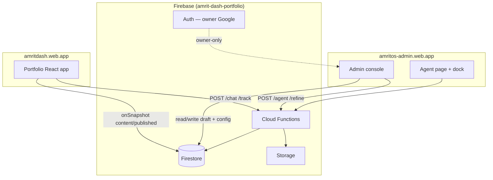

# AGENTS.md

## Cursor Cloud specific instructions

This is the `amrit.os` portfolio — a retro-OS React shell served from `public/`, with a **Firebase backend** (Cloud Functions, Firestore, Storage, Auth). The UI is React 18 loaded from a CDN; JSX is transpiled in the browser by `@babel/standalone` during local dev. Production deploys run `npm run build` (esbuild) into `dist/site` and `dist/admin`. No test framework or linter is configured.

### Running the dev server

```bash
npx serve public -l 3000
```

Serves `public/` at <http://localhost:3000>. `serve` is auto-installed by `npx` on first run.

- Portfolio: <http://localhost:3000/> (or `index.html`)
- Admin console: <http://localhost:3000/admin.html> (production: `amritos-admin.web.app`)

For production-shaped assets: `npm run build` then `npm run preview` (serves `dist/site` on port 3001).

### Architecture



**Draft vs publish:** The admin edits `content/draft`. The public site streams `content/published`. The agent writes **only to draft**, snapshots before each turn (undo), and never publishes unless the owner explicitly invokes `publish` (tool or UI). `localStorage` (`amritos.*`) remains an offline cache and instant first-paint fallback; Firestore is the durable source of truth.

**Owner-only auth:** Google sign-in restricted to the owner email (`OWNER_EMAIL` in `functions/index.js`, mirrored in `firestore.rules`). All admin/agent endpoints verify a Firebase ID token server-side.

**Tool results** may include admin deep links (`#hero`, `#projects`, etc.) and live-preview URLs so the owner can jump to affected sections after a turn.

### Project structure

**Frontend (`public/`)**
- `index.html` — portfolio entry; loads React/ReactDOM/Babel from CDN, then `data.jsx → tweaks-panel.jsx → app.jsx`
- `admin.html` — admin console entry; loads `data.jsx` then `admin/store.jsx → ui.jsx → … → admin/agent.jsx → app.jsx`
- `styles.css` — portfolio styles
- `shared-schema.js` — enums, defaults, validation (shared by browser + Functions via predeploy copy)
- `data.jsx` — seed content + Firestore/localStorage hydration layer
- `tweaks-panel.jsx` — shared host-editable Tweaks shell (dormant in production)
- `app.jsx` — portfolio React app
- `admin/` — admin modules (`store.jsx`, editors, `agent.jsx`, `agent-settings.jsx`, `refiner.jsx`, `bot.jsx`, `logs.jsx`) + `admin.css`
- `assets/` — images, icons, gallery shots, CVs (only referenced files live here)

**Backend (`functions/`)**
- `index.js` — HTTP endpoints (see below) + scheduled inbox triage
- `agent/loop.js` — provider-agnostic tool loop (canonical messages, sequential mutating tools, caps)
- `agent/tools.js` — tool registry + executors
- `agent/providers/` — native adapters (Gemini, Anthropic, OpenAI-compatible)
- `agent/content-ops.js` — array-aware path set, blocklist, snapshot ring(10), undo
- `agent/guards.js` — path blocklist, inbox injection guard, restricted tool sets
- `agent/publish.js`, `agent/audit.js`, `agent/messages.js`, `agent/multimodal.js`, `agent/inbox-triage.js`

**Ops**
- `firebase.json` — two hosting targets, functions, Firestore/Storage rules, emulators
- `firestore.rules`, `storage.rules`
- `scripts/build-dist.mjs` — esbuild JSX → `dist/site` + `dist/admin`
- `scripts/deploy-{site,admin,backend}.sh` — deploy scripts
- `.github/workflows/deploy-{site,admin}.yml` — path-filtered hosting deploy on push to `amrit-os`
- `.github/workflows/deploy-backend.yml` — manual `workflow_dispatch` for functions + rules

### Cloud Functions endpoints

| Endpoint | Auth | Purpose |
|---|---|---|
| `GET /warmup` | public | Cold-start defeat (boot splash) |
| `POST /chat` | public (+ owner bypass on rate limit) | Visitor bot proxy; keys from `config/llm` |
| `POST /track` | public | Analytics ingest |
| `POST /clearStats` | owner | Wipe analytics |
| `POST /agent` | owner | Agent tool loop |
| `POST /refine` | owner | Inline field refiner (no tools) |
| `POST /models` | owner | Fetch provider model lists |
| `POST /logs` | owner | Paginated app logs for admin Logs view |
| `POST /inboxPurge` | owner | Rules-only inbox junk cleanup |
| `POST /inboxProcess` | owner | Purge + AI triage → `config/inboxRun` |
| `POST /testModel`, `/testVision`, `/testCapabilities` | owner | Provider smoke + capability probes (vision, URL) |
| `(scheduled) inboxWeekly` | — | Monday 03:00 IST auto-triage |

Region: `asia-south1`. Keys live in Firestore (`config/llm`, `config/agent`); Functions read via Admin SDK — never returned to the browser.

### Firestore collections

| Path | Purpose |
|---|---|
| `content/draft` | In-progress portfolio content (admin + agent writes) |
| `content/published` | Live snapshot the public site reads |
| `config/llm` | Bot provider keys + models |
| `config/agent` | Agent provider keys + models (separate from bot) |
| `config/settings` | Rate limits, retention, agent daily turn cap |
| `config/inboxRun` | Last inbox triage run state |
| `bot_questions/{id}` | Visitor question inbox |
| `stats/global`, `stats_daily/{date}` | Analytics counters |
| `events/{id}` | Capped activity feed |
| `ratelimits/{key}` | Per-IP throttle bookkeeping (server-only) |
| `agent_chats/{chatId}` | Agent thread metadata |
| `agent_chats/{chatId}/messages/{id}` | Canonical chat + tool turns |
| `agent_snapshots/{chatId}/turns/{turnId}` | Pre-turn draft copies (ring 10, undo) |
| `agent_audit/{id}` | Key-redacted turn audit |
| `agent_daily/{date}` | Daily agent turn counter (server-only) |

### Agent architecture

1. Owner sends a message (Agent page or floating dock) → `POST /agent` with Firebase ID token.
2. Loop loads `config/agent` key server-side, `content/draft` into an in-memory session, saves a snapshot.
3. Provider adapter runs a tool loop (≤25 iterations). **Content-mutating tools execute sequentially** against one draft copy.
4. On success: single `content/draft` write with `updatedAt` precondition; persist canonical messages + audit.
5. Admin `onSnapshot` on `content/draft` adopts agent writes live (pauses autosave during turns; preserves focused field).
6. Response includes `{ reply, toolCalls, changedPaths, reviewLinks, quickReplies }`.

**Providers:** Gemini (default), Anthropic (native Messages API), OpenAI-compatible (OpenAI / OpenRouter / Mistral / Grok / Groq). Switching provider starts a fresh thread (foreign tool-call IDs must not replay).

**Inbox mode:** Visitor text is delimiter-wrapped; `publish`, `undoLastChange`, and `generateImage` are omitted from the tool schema.

**Blocklisted paths** (any tool): `bot.providers*`, `bot.behavior*`, `config.llm*`, `config.agent*`.

### Agent tool inventory

Hybrid catalog: generic `readContent` / `setContentPath` for most edits; structured tools for arrays, media, publish, inbox, and ops. Registry: `functions/agent/tools.js`.

#### Core — content (implemented)

| Tool | Mutates | Notes |
|---|---|---|
| `readContent` | no | Read a `content/draft` slice by dot-path |
| `setContentPath` | yes | Set/merge at path; server blocklist + enum validation |
| `addItem` | yes | Append to a named collection |
| `removeItem` | yes | Remove by index or id |
| `reorder` | yes | Reorder collection by id/index list |
| `applyVibePreset` | yes | Apply cosmetic vibe preset |
| `setProjectImage` | yes | Place thumb/gallery URL (no generation) |
| `generateImage` | yes | Generate raster via Gemini/DALL·E → Storage → attach |
| `setCv` | yes | Set CV PDF path (light/dark) |
| `publish` | side effect | Ship draft → published; strips keys from public copy |
| `undoLastChange` | side effect | Restore latest pre-turn snapshot |

#### Core — settings & inbox (implemented)

| Tool | Mutates | Notes |
|---|---|---|
| `setLimits` | side effect | Update `config/settings` rate limits |
| `listInboxQuestions` | no | List `bot_questions` inbox |
| `dismissInboxQuestion` | side effect | Delete inbox item |
| `acceptInboxToQA` | yes | Append Q&A pair + remove inbox item |

#### P0 — ops (implemented)

| Tool | Notes |
|---|---|
| `clearChatHistory` | Clear `agent_chats` thread messages |
| `runInboxTriage` | LLM triage of inbox (wraps `/inboxProcess` logic) |
| `purgeInboxJunk` | Rules-only junk/duplicate cleanup |
| `uploadAsset` | Upload image/PDF to Storage; optional project/CV attach |
| `getDraftStatus` | Draft metadata: `updatedAt`, pending changes vs published |

#### P1 — read & sync (implemented)

| Tool | Notes |
|---|---|
| `readAnalytics` | Headline stats + daily buckets |
| `readAgentLogs` | Recent agent/bot/refine log entries (Cloud Logging) |
| `readSettings` | Read `config/settings` |
| `syncDraftFromPublished` | Copy published snapshot into draft (preserves draft API keys) |
| `refineField` | Inline rewrite proposal for a field (tool form of `/refine`) |

#### P2 — bot config (implemented)

| Tool | Notes |
|---|---|
| `readBotConfig` | Read allowed bot config subset (no keys in responses) |
| `setBotBehavior` | Update `bot.behavior` toggles (temperature, tokens, matchThreshold, tone) |

#### P3 — inbox intelligence (implemented)

| Tool | Notes |
|---|---|
| `applyInboxSuggestion` | Apply triage verdict: phrase, new Q&A, or dismiss |
| `generateInboxVariations` | LLM phrase/answer options for an inbox question (pairs with `refineField`) |

#### Insights — read-only summaries (implemented)

| Tool | Notes |
|---|---|
| `getContentSummary` | Compact outline of draft content |
| `compareDraftToPublished` | Path-level diff draft vs live |
| `getInboxRunState` | Last triage run from `config/inboxRun` |
| `getAnalyticsInsights` | Week-over-week trends and highlights |
| `getSiteHealth` | Broken asset paths, missing thumbs, empty expertise |
| `getRecentVisitorActivity` | Recent events + inbox questions |
| `getPublishInfo` | Last publish time + pending change scope |

#### Other (implemented)

| Tool | Notes |
|---|---|
| `setConsoleTheme` | Admin console theme/accent (`config/console`) |
| `clearAnalytics` | Owner wipe (wraps `/clearStats`) |
| `searchContent` | Text search across draft paths |

**40 tools** total in `ALL_TOOLS` (includes `fetchUrl`). Tool results may include `links[]` admin deep links (rendered in Agent chat). Helpers: `functions/agent/admin-links.js`.

#### Removed (replaced)

| Tool | Replacement |
|---|---|
| `validateInboxQuestion` | `runInboxTriage` |
| `generateQAVariations` | `generateInboxVariations` |

### Admin routes

Hash routes in `public/admin/app.jsx`:

| Route | Section |
|---|---|
| `#overview` | Dashboard headline stats |
| `#analytics` | Analytics charts + activity |
| `#hero`, `#about`, `#expertise`, `#work`, `#projects`, `#cards`, `#contact` | Content editors |
| `#media`, `#appearance` | CV/media + cosmetics |
| `#agent` | Agent chat + audit + undo |
| `#bot` | AmritBot Q&A, providers, inbox review |
| `#sync` | Sync & deploy status |

The **Agent dock** floats on all routes (shared session). Settings for agent keys live in the agent settings modal (`admin/agent-settings.jsx`).

### Firebase deploy

```bash
npm run deploy:site      # portfolio → amritdash.web.app
npm run deploy:admin     # admin → amritos-admin.web.app
npm run deploy:hosting   # both sites
npm run deploy:backend   # functions + firestore:rules + storage (manual / workflow_dispatch)
```

Hosting CI (`deploy-site.yml` / `deploy-admin.yml`) deploys on push to `amrit-os` when matching paths change. Backend deploy requires broader IAM — kept manual via `deploy:backend` or the GitHub Actions workflow.

Local emulators: `firebase emulators:start` (Auth, Firestore, Functions, Storage, Hosting). Agent smoke: `node scripts/agent-smoke.cjs` with `AGENT_PROVIDER` / `AGENT_KEY` against the Firestore emulator.

### Notes

- JSX in `public/` transpiles in-browser at dev time; production uses esbuild output in `dist/`.
- Admin live-preview uses cross-origin `?adminpreview=` on the portfolio site (`amritdash.web.app`); draft/published must stay in sync via Firestore, not shared `localStorage`.
- `shared-schema.js` is copied into `functions/` on functions predeploy — keep browser and server enums in sync.
- See `docs/handover/2026-06-02-admin-agentic-ai-handover.md` for implementation history; `PLAN.md` for the broader production migration roadmap.
